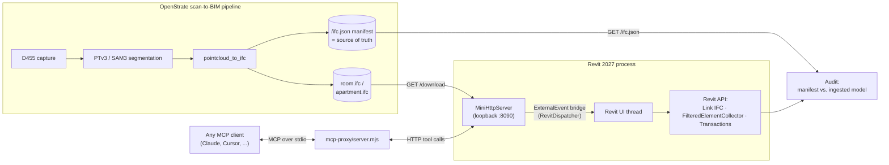

# OpenStrate ⇄ Revit Bridge

**A C# Revit add-in that turns a live Revit session into an agent-callable tool server, and uses it to QA scan-to-BIM deliverables against their own pipeline's source of truth.**

Built in two days as a working answer to a hiring team's fair observation that my resume showed no Revit API experience. This is what the gap looks like after 48 hours: Link IFC ingestion, `FilteredElementCollector` audits, transaction discipline, `ExternalEvent` thread marshaling, an MCP server, and an 11-assertion end-to-end suite that caught a real interoperability defect on its first run.



## What it does

| Tool | Description |
|---|---|
| `open_host` | Creates and activates a host project programmatically (no UI clicking) |
| `ingest` | Fetches the pipeline's current IFC over HTTP, generates the cache RVT, links it via **Link IFC** (Revit's fully-supported IFC4 path) |
| `model_stats` | Element census of the ingested scan: counts by category and level |
| `query_elements` | Filtered element listing, keyed by `UniqueId` (never `ElementId` — it isn't stable) |
| `get_element` | Full parameter dump for one element; doubles flagged as Revit internal units (feet) |

An **audit** diffs what Revit actually ingested against the pipeline's own `/ifc.json` manifest — the authoritative source of truth. Wall counts, class mapping, element census, all reconciled mechanically.

## Real defects it caught on day one

1. **`IfcCovering` → Generic Models**: the pipeline's ceiling entity is silently re-categorized by Revit on ingestion — invisible to eyeballs, caught by the manifest diff, reproduced across both the legacy Open IFC path and Link IFC (which localizes the bug to the exporter's entity attribution).
2. **Duplicate parameter display names** on IFC-imported elements crash naive parameter dictionaries — found by the e2e suite, fixed with grouped first-non-empty resolution.

## Design rules (the ones that bite)

- **No Revit API off the UI thread.** All tool calls marshal through an `ExternalEvent` (`RevitDispatcher`): background threads enqueue, Revit executes at idle, results return via `TaskCompletionSource`, with an idle-timeout guard for modal deadlocks.
- **No network inside a transaction.** All HTTP completes before any document work begins.
- **Identity is `UniqueId`.** Audit artifacts stay comparable across sessions.
- **Read tools are `TransactionMode.ReadOnly`.** A QA gate mutates nothing.

## Zero-click dev loop

```powershell
.\dev-loop.ps1   # kill Revit → build → deploy → launch → open_host → ingest → census
.\test-e2e.ps1   # 11 assertions: manifest ↔ bridge ↔ queries ↔ known findings ↔ MCP proxy
```

## Talk to your Revit model from an MCP client

`mcp-proxy/server.mjs` speaks MCP over stdio and forwards to the in-process server:

```jsonc
// .mcp.json
{ "mcpServers": { "revit-bridge": { "command": "node", "args": ["<path>/mcp-proxy/server.mjs"] } } }
```

Then ask your agent: *"How many walls are in this model, and which are missing a level?"* — the answer comes from a live `FilteredElementCollector`, not a hallucination.

## Roadmap

- [ ] Consent-gated write tools (`set_parameter`, `relabel`) routed through [consent-gateway](https://github.com/realitymatrix/consent-gateway): allow/consent/deny policy, native human approval, hash-chained receipts — agent writes that are safe to act on
- [ ] Round-trip editing: Revit selection → `POST /relabel` back into the reconstruction pipeline
- [ ] Golden Q&A eval suite grading agent answers against manifest ground truth
- [ ] Headless runs via Autodesk Platform Services Design Automation (CI gate)

## Build

Requires .NET 10 SDK + Revit 2027 (or `-p:RevitVersion=2025` with .NET 8).

```powershell
dotnet build -c Release   # auto-deploys DLL + manifest to %AppData%\Autodesk\Revit\Addins\<ver>\
```

## Part of a larger stack

This bridge is one edge of an agent-governance ecosystem built in the open: [consent-gateway](https://github.com/realitymatrix/consent-gateway) (MCP policy proxy with human-in-the-loop consent), [consent-request-protocol](https://github.com/realitymatrix/consent-request-protocol) (open protocol for agent-requested, human-approved actions), [upload-bridge](https://github.com/realitymatrix/upload-bridge) (deny-by-default file broker). The scan-to-BIM pipeline it audits is [OpenStrate Recon](https://openstrate.pro).

MIT © Petr Korolev
